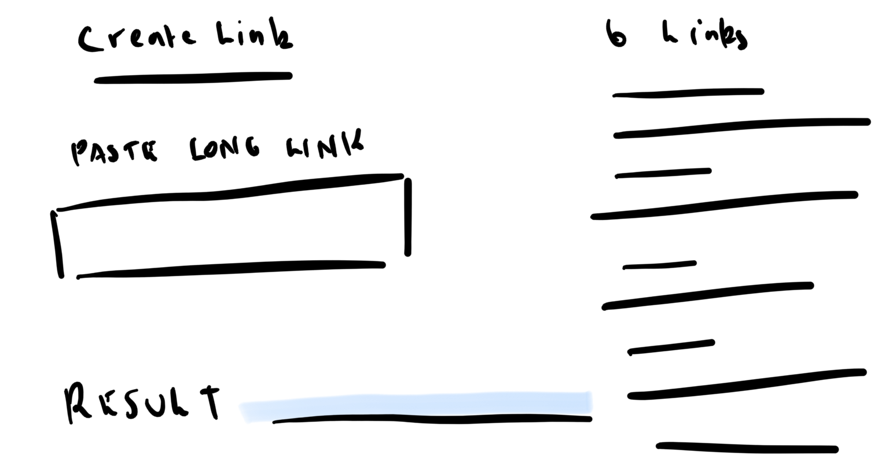

## Bitly Clone

## Specs

Website URLs can get really, really long.

Bitly showed up in 2008 with a solution. Bitly turns a long URL into a tiny URL that looks something like this: http://bit.ly/aj7fghe

When a user goes to the short URL, it takes them to Bitly. Bitly then takes the hash from the url (in this case: aj7fghe) and looks up the original URL to redirect the user.

For such a simple service, Bitly's worth tens of millions of dollars. Let's create our own URL shortener and get rich boiiii. 💰💰💰

If you haven't used Bilty before, head on over and shorten a link.

### What would this look like if it were easy?

You're probably already thinking about the app's architecture.

Which models, controllers, views? Which hashing library? Which APIs? Which gems? Any crazy relationships?

We tend to over complicate our projects. I want you to ask yourself, whenever you start a new project: what would this look like if it were easy?

### MVP

Bitly has all sorts of cool features like analytics and site previews.

For our MVP, let's focus on one user story: As a user, I want to shorten long URLs so that they don't take up so much room in my emails.

We can tackle this user story with the following features:

1. A home page with an input box and a submit button.
2. Some kind of URL shortening logic (i.e. URL to hash, hash to URL)
3. A success page showing the shortened URL.
4. The redirect logic.

### Wireframes

Here is a basic wire frame. Feel free to change it up.



### How should we approach this?

Example user input:

`https://docs.google.com/presentation/d/1kLq7h6Y-vEocvC-Pu99RqEh1-hpSzKNhOlfPgrhhzf-ffdd-kan-ye-1sth3g-reat3st-rapp3r-aliv3`

Example app output:

`http://localhost:3000/abc123`

Seriously, spend a few minutes thinking about how you'd build the app. What would this look like it it were easy?

How might your ERD look? When would you hash/decode? What's the form look like? Can you simplify anything?

Come up with any kind of rough plan on your own before reading further.

### The URL shortening logic

Maybe we should use something like sha1 to hash the url?

```rb
sha1.hash("http://google.com/example/url/123/456") # => e71f07dc56c262519354466401e8e2c704f5e24e
```

This would work but it means the same URL always returns the same hash. In the spirit of maintaining an extensible architecture, let's keep each URL unique.

Why does each link need to be unique? Features like stats are outside of MVP but low hanging fruit for future features. If we want to collect stats on a hash, it should be unique. E.g. Scott shortening `google.com` should produce a different link to Simon shortening `google.com`. This doesn't mean extra work, it's more about a well thought out foundation. After all, we're keen to get to MVP ASAP (I'm coining it: MASAP - *throws a hash rocket hand gesture*)

Another problem with sha1: even a tiny input gives us a huge output. Congratulations, you're the world's first URL longering (it's a word) service.

### Can you think of another solution?

We're not handling user authentication, so we can't make the URL unique based on the user.

Each URL we add to our database will have a unique ID number. How about we just hash that ID number. That way, every URL will have a unique hash.

And for the actual hashing, let's just convert the ID number to another base.

```rb
1000000000.to_s(36) # => "gjdgxs"
```

One billion in base 36 is "gjdgxs". That means the first one billion links will be, at most, 6 characters long. Perfect.
ERD + Example Data

Our app will be beautifully simple. One database table, "links", should cover MVP.

**Links Table**

|id        |original_url     |hash               |created_at         |updated_at         |
|----------|-----------------|-------------------|-------------------|-------------------|
|1000000000|http://google.com|gjdgxs             |YYYY-MM-DD HH:MM:SS|YYYY-MM-DD HH:MM:SS|

If we have a route for /:hash, we can pull out the :hash parameter and check our database for a matching link before redirect to the link's original_url.

```rb
link = Link.find_by_hash(params[:hash])
redirect_to link.original_url
```
Can you think of a way to simplify this ERD further? Maybe we don't even need the hash column.

If we convert the hash back from base36 on the fly, we don't ever need to store it.

```rb
id = params[:hash].to_i(36)
link = Link.find(id)
redirect_to link.original_url
```

**Links Table**

|id        |original_url     |updated_at         |created_at         |
|----------|-----------------|-------------------|-------------------|
|1000000000|http://google.com|YYYY-MM-DD HH:MM:SS|YYYY-MM-DD HH:MM:SS|

A single model with a single attribute?! OMGROFLCOPTER!

### Which framework?

All the planning we've done so far is framework agnostic. No matter which language or framework we use to build the app, these underlying decisions had to be made. Keep this in mind as we switch to Node.js next term.

### Work flow

As you build this app, imagine your coworkers will be inheriting the project in the future. Aim for quality software; spend time considering each decision you make.


1. Commit early and often. Branching is probably overkill for MVP.
2. Commit messages should be descriptive.
3. Build ugly bare bones functionality and then spend time on the aesthetics. I.e. get it working before you make it look good.
4. Keep your CSS + HTML clean. Use as few element as possible and as few CSS rules as possible.
5. Keep the app clean. If you use generators to get started, make sure you delete the unused parts.
6. Make sure all your code is indented perfectly.
7. Using a gem? Make sure you need it.

### Build it!

Use your Rails skills to get to MVP. Keep it simple. You probably only need one controller with a few actions.

This is an easy app, focus on a quality code base.